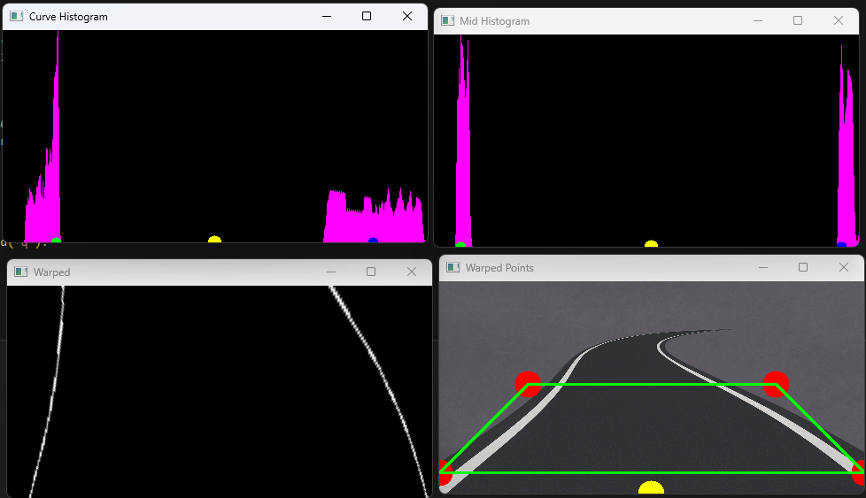
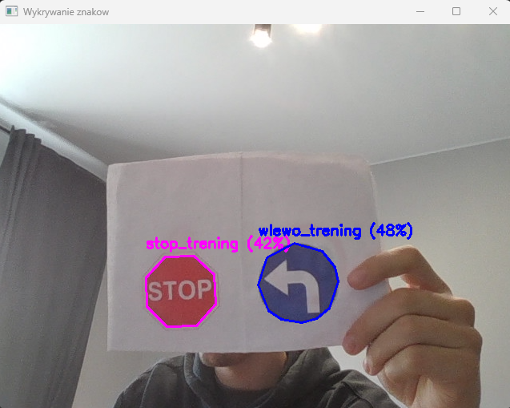

# 🚗 Autonomous Car Platform — Lane and Traffic Sign Detection (Work in Progress)
[](LICENSE)

**Status:** Development in progress  
**Language:** Python 3.13.7  
**Operating System:** Windows 11  

This repository contains the core vision algorithms for an **autonomous car platform** that will eventually operate as a small, physical vehicle.  
The main objective of this project is to develop a system capable of **independent movement along a simulated road**, detecting and reacting to **traffic signs** from a predefined image database.

The project is developed as part of an **engineering thesis at Wrocław University of Science and Technology**.

---

## 🎯 Project Overview

The platform aims to:
- Follow road lanes based on camera vision,
- Detect and classify road signs from a live camera feed,
- Eventually integrate both systems on a **Raspberry Pi controller** for autonomous driving.

Currently, two independent modules are implemented:

| Module | Description |
|--------|--------------|
| **`Line_detect.py`** | Detects the center of a driving lane on a road image using perspective transform and histogram analysis. |
| **`Sign_detect.py`** | Recognizes road signs from a live camera feed using classical computer vision (ORB descriptors, color & shape analysis). |

Both algorithms work **without machine learning** — the system relies solely on deterministic image processing methods.

---

## ⚙️ Features (Current State)

### 🧩 Lane Detection (`Line_detect.py`)
- Works on static road images (e.g., `Linia_drogi/droga2.png`)
- Uses **HSV thresholding** and morphological operations to isolate lane markings
- Applies **perspective transform** to simulate a top-down view
- Computes lane center using **histogram-based analysis**
- Interactive configuration via **trackbars** for ROI and color thresholds

### 🚸 Traffic Sign Detection (`Sign_detect.py`)
- Real-time video capture from laptop camera (via OpenCV)
- Multi-stage detection combining:
  1. **Edge and contour extraction**
  2. **Shape classification** (triangle, circle, octagon)
  3. **Dominant color detection** (HSV-based)
  4. **ORB descriptor matching** against an image database (`baza_do_porownania`)
- Classifies signs such as:
  - Stop  
  - Warning (triangular, orange)  
  - Speed limits  
  - Mandatory signs (blue circular)

## 📥 Inputs / 📤 Outputs

**Lane detection (`Line_detect.py`):**
- **Input:** static road image (currently `Linia_drogi/droga2.png`).
- **Processing:** HSV thresholding → perspective warp → column histogram.
- **Output (for now):**
  - Debug windows (`Warped`, `Warped Points`, histograms),
  - Printed curve/center value in console (used later for steering logic).

**Traffic sign detection (`Sign_detect.py`):**
- **Input:** live video from laptop camera (index `0` by default).
- **Processing:**
  - Edge and contour detection,
  - Shape classification (triangle / circle / octagon),
  - Dominant color (HSV),
  - ORB matching against image database in `baza_do_porownania/`.
- **Output:**
  - Live window with detected sign contour and text label (e.g. `STOP (92%)`),
  - Optional debug windows (edges, ROI, ORB matching preview).

---

## 🧠 Technologies Used

- **Python 3.13.7**
- **OpenCV**
- **NumPy**
- **Math**
- **Jupyter Notebook** (for prototyping and testing)

> No machine learning or deep learning techniques are used in this project.

---

## ⚠️ Known Limitations (WIP)

- Lane detection currently works on a **single static image** only (no video yet).
- Sign detection is tuned for a specific lighting setup and camera; thresholds may require manual tuning.
- The traffic sign database in `baza_do_porownania/` is limited and does not cover all possible signs.
- Control logic (steering/throttle) and Raspberry Pi integration are **not implemented yet**.
- No automated tests yet — most validation is done visually via debug windows.

---
## 📝 Changelog (recent)

- 2025-11-03: Documented lane and sign detection modules, added WIP limitations.
- 2025-11-02: Improved traffic sign classifier (shape + color → ORB group selection).
- 2025-11-01: Initial version of lane detection on static image (`droga2.png`).

---

## 🧩 How to Run

1. Clone this repository:
   ```
   git clone https://github.com/TomaszMarekQ03/Autonomous_car.git
   cd Autonomous_car
   ```

2. Create and activate a virtual environment:
  ```
    python -m venv .venv
    .\.venv\Scripts\activate
  ```

3. Install dependencies:
  ```
    pip install -r requirements.txt
  ```

4. Run each module separately:
  ```
    # For lane detection (static image)
    python Python_codes/Line_detect.py

    # For traffic sign detection (camera)
    python Python_codes/Sign_detect.py
  ```

⚠️ Make sure your webcam is connected for sign detection.

---

## 🗂️ Repository Structure
```
Autonomous_car/
├── Python_codes/
│ ├── Line_detect.py
│ ├── Sign_detect.py
├── Linia_drogi/
│ ├── droga2.png
├── baza_do_porownania/
│ ├── STOP/
│ ├── NAKAZ/
│ ├── OSTRZEGAWCZE/
│ ├── OGRANICZENIA/
├── README.md
├── requirements.txt
```
---

## 🖼️ Example Output

| Lane Detection | Traffic Sign Detection |
|----------------|------------------------|
|  |  |

---
## 📊 Project Status

> **Current Stage:** Feature development  
> **Next Milestone:** Lane detection code expansion - crossroads detecting  


### 🛣️ Project Roadmap (WIP)

- [x] 3D printed Car design
- [x] Electrical components selection
- [x] Lane detection using static image
- [x] Traffic sign detection using camera
- [ ] Crossroads detection in Lane detection code
- [ ] Integrate both systems into one module
- [ ] Implement Raspberry Pi support (camera + motor control)
- [ ] Add basic PID steering logic and sign queue
- [ ] Prepare final demo with autonomous movement


